<!-- # Three dimensional camera techniques -->


Recently, 3D cameras have been widely used in various computer vision applications, like robotics, autonomous driving. Leveraging the extra data provided by such sensors allows for better performance on tasks such as detection and recognition, pose estimation, 3D reconstruction, and so forth. The post presented some common knowledge about the 3D cameras, including the overview of the most common 3D sensing techniques on the markets and their underlying mechanisms, some camera calibration technology, hand-eye calibration methods, mapping depth to point cloud.
### 1. 3D camera technique
At present, the three prevalent 3D imaging technologies are **binocular stereo vision, time of flight (ToF) and structured light**. Concerning active light source projection, the techniques fall into passive and active categories. Binocular stereo vision is a passive technique and the other two are active techniques.
#### 1.1. Bibocular stereo vision
Computer stereo vision is the extraction of 3D information from digital images, such as those obtained by CCD cameras. [By comparing the information about a scene from two vantage points, 3D information can be extracted by examining the relative position of objects in the two panels](https://en.wikipedia.org/wiki/Computer_stereo_vision). This skill mimics the binocular vision of human beings. Humans have two eyes from which there is about 60mm to 70mm apart. It will result in slight image location disparity when the eyes view the same scene. The stereo vision which is the same as the human eye needs two lenses, enabling each of them to capture these slightly different images. Based on this disparity, the depth information can be computed. It is a passive technique because no external light is required other than the ambient light, which means it is suitable for outdoor use in relatively good light conditions. The stereo matching method of this technique requires the great processing power of the sensor to guarantee resolution and instantaneous output. Constrained by the baseline, this skill often works in a short range, often within 2 meters. Famous stereo cameras include *ZED 2K Stereo camera of sterols* and *Point grey's BumbleBee*.
<!--  -->
<p align="center">
  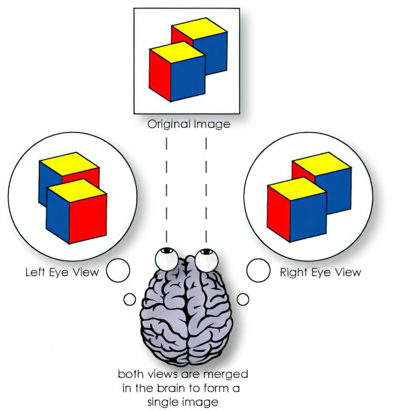
  <em>Bibocular stereo visio</em>
</p>

#### 1.2. ToF
ToF is a technique of calculating the distance between the camera and the object, by measuring the time it takes the projected infrared light to travel from the camera, bounced off the object surface, and return to the sensor. Due to the constant light speed, the processor can calculate the distance of the object and reconstruct it by analyzing the phase shift of the emitted and returned light. Unlike the stereo vision technology, *ToF is an active technique, as it actively projects light to measure the distance, instead of relying on ambient light*. It works well in dim or dark light conditions. ToF cameras are widely applied in the field of VR/AR, robotic navigation, objective recognition, and auto piloting. Well-known products are a series of *Kinect depth cameras produced by Microsoft*.
<!-- 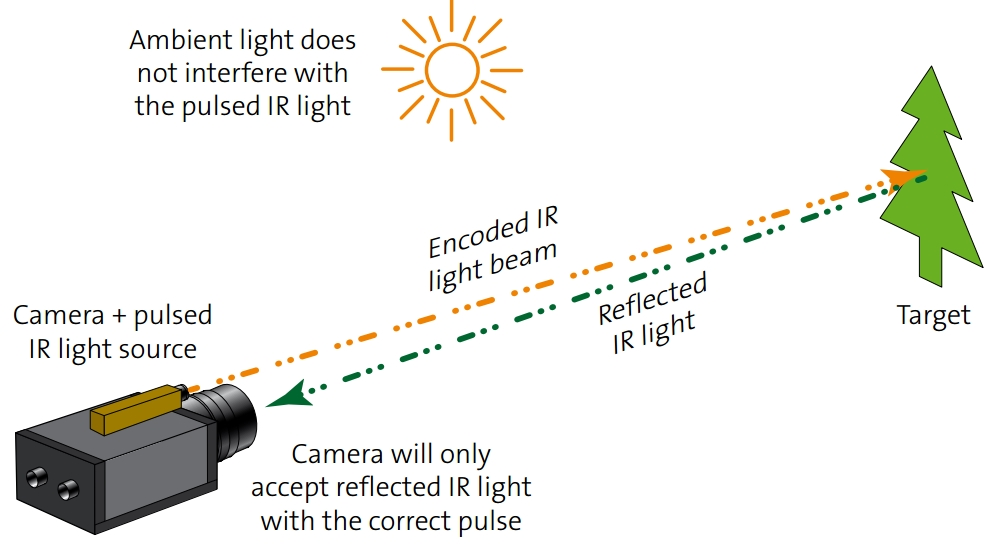 -->
<p align="center">
  
  <em>Time of Flight</em>
</p>

#### 1.3. Structured light
The structured light technique is another active 3D imaging method, which is very similar to the stereo vision technique on basic mechanisms. Different from the stereo vision method, it employs structured light without depending on external light conditions. The cameras project modulated pattern to the surface of a scene and calculate the disparity between the original projected pattern and the observed pattern deformed by the surface of the scene. As an active skill, structured light cameras can work well in conditions lacking light or texture as well. **Compared with the ToF method, the well-modulated light pattern can generate higher accuracy in the short range.** And the depth resolution can reach the submillimeter level. *Intel adopts a structured light technique in the Realsense depth camera series.* Structured light cameras are proper for cases requiring high accuracies in short-range, such as face recognition, gesture recognition, and industrial inspection.
<!-- 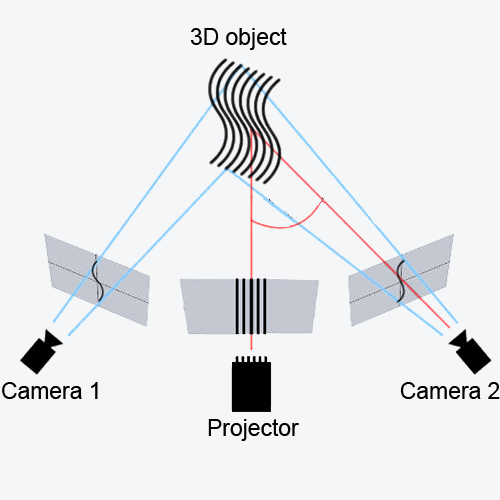 -->
<p align="center">
  
  <em>The structured light</em>
</p>

#### 1.4. Pros and cons
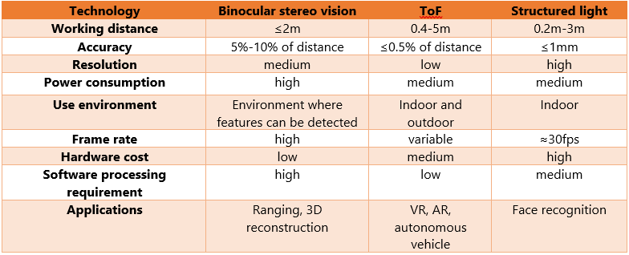

### 2. Camera calibaration
[Camera calibration is a necessary step in 3D computer vision to extract metric information from 2D images](https://www.microsoft.com/en-us/research/wp-content/uploads/2016/02/tr98-71.pdf). Calibration aims to find the quantities internal to the cameras that affect the image process, including image center, focal length, lens distortion parameters. The precise internal camera parameters are of paramount importance for the 3D interpretation of images, reconstruction of world models, and robot interaction with the world.

#### 2.1.  Pinhole camera model
[The pinhole camera model is a model of an ideal camera, that describes the mathematical relationship between the real world 3D object's coordinates and its 2D projection on the image plane ](https://en.wikipedia.org/wiki/Pinhole_camera_model). Its validity depends on the quality of the camera and, in general, decreases from the center of the image to the edges as lens distortion effects increase.
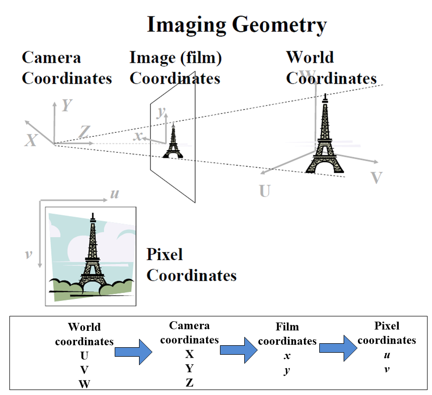
[As shown in the above figure](http://www.cse.psu.edu/~rtc12/CSE486/), if we want to understand the relation between the 3D objects and the corresponding 2D images, the mathematical model is needed to describe the relationship. In this post, we use $(\textbf U, \textbf V, \textbf W)$, $( \textbf X, \textbf Y, \textbf Z)$, $(x, y)$, and $(u, v)$ to depict the positions of an object in real-world space, camera space, film space, and pixel space respectively. Firstly, we will build a model to map objects from camera coordinates to film coordinates.
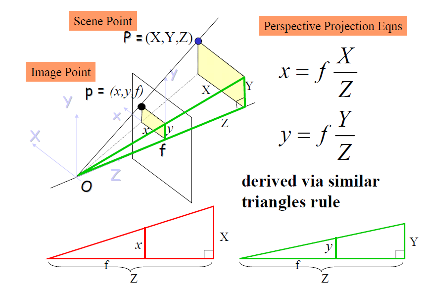
As shown in the above figure, the $(x, y)$ in the film space can be derived from the point in camera space via similar triangles rule. $f$ is the focal length. It is worth to be mentioned that the focal length along the x-direction, y-direction can be different, and it can be depicted by $f_x$, and $f_y$. The origin of the image in film space is at its center, while the origin of the pixel space is at the top-left position. So the offsets are needed to transfer the points in film space to those in pixel points. $o_x$ and $o_y$ are called $x$ offset and $y$ offset respectively.
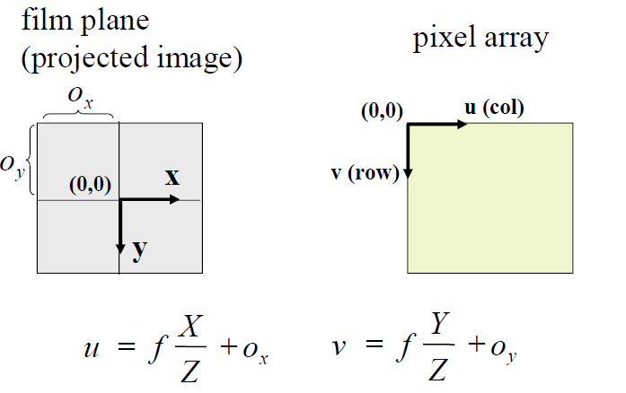
The above two processes often are put together, which can be described by a $3\times3$ matrix $\mathbf K$. The parameters in $\mathbf K$ is the intrinsic parameters of the camera. It is different from different devices. It is recommended that these parameters should be known before you use a camera.
The variance of data set $\mathbf{z_1}$

$$\mathbf{K} = {\left[ \begin{matrix}
  f_x & 0 & o_{x}  \\\\
  0 & f_{y} & {{o}_{y}}  \\\\
   0 & 0 & 1  \\\\
\end{matrix} \right]}$$

So the pixel coordiante value can be obtained by:
$${{\left[ \begin{matrix}
   u & v & 1  \\
\end{matrix} \right]}^{T}}=\mathbf{K}{{\left[ \begin{matrix}
   {X}/{Z}\; & {Y}/{Z}\; & 1  \\
\end{matrix} \right]}^{T}}.$$
Mapping objects from real-world space to camera space could use a homogeneous transformation matrix $\mathbf T$, which is a common approach to describe the body transformation in 3D space.
$$\mathbf T = \left[ \begin{matrix}
   {{r}\_{11}} & {{r}\_{12}} & {{r}\_{13}} & {{t}\_{x}}  \\\\
   {{r}\_{21}} & {{r}\_{22}} & {{r}\_{23}} & {{t}\_{y}}  \\\\
   {{r}\_{31}} & {{r}\_{23}} & {{r}\_{33}} & {{t}\_{z}}  \\\\
   0 & 0 & 0 & 1  \\\\
\\end{matrix} \right]$$
By combining all the mentioned transform matrix, the objects in 3D real-world space can be transferred into the 2D image space, as shown in the following figure. The way in how to calibrate the internal and external parameters of the camera will be presented in the next subsection 3.
<!-- 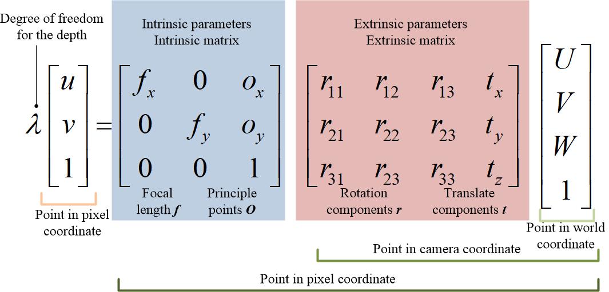 -->
<p align="center">
  
  <em>Pinhole camera model</em>
</p>

#### 2.2 Lens Distortion Model
Most cameras on the market are made up of convex lens to capture light, which brings some issues to be addressed: [1. have finite aperture so a blurring of unfocused objects appears; 2. contain geometric distortions due to lenses, which increase as we get closer to the edges of the lenses](https://ori.codes/artificial-intelligence/camera-calibration/camera-distortions/#fn:1). The most common type of camera lens distortion is called radial distortion, including positive or barrel radial distortion and negative or pincushion radial distortion, as depicted in the below figure.
<!-- 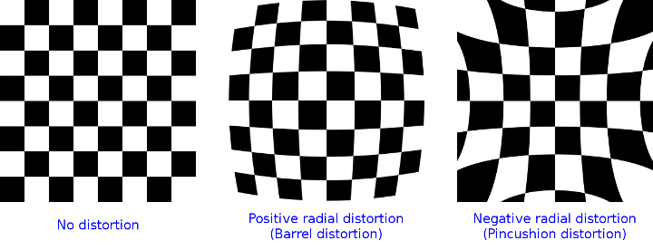 -->
<p align="center">
  
  <em>Radial distortion of lens camera</em>
</p>

Some action cameras which have large FOV will cause a lot of positive radial distortion. The negative radial distortion is often caused by the lens being not aligned perfectly parallel to the imaging plane. It leads to the image look tilted, which is bad for us since some objects look further away than they are. Next, we will discuss how to avoid the radial distortion, and two couples of coefficients $k_i$, describing radial distortion and $p_i$, describing the tangential distortion. The worse the distortion, the more coefficients we need to accurately describe it. More details about these parameters were given in [OpenCV docs](https://docs.opencv.org/2.4/modules/calib3d/doc/camera_calibration_and_3d_reconstruction.html#camera-calibration-and-3d-reconstruction). In the pinhole camera model, we use intrinsic matrix $\\mathbf K$ to map object in camera coordinate to image in pixel coordinate. Expanding matrix $\\mathbf K$, the following equations can be derived.
$$\begin{align}
  & x=X/Z \nonumber \\\\
 & y=Y/Z \nonumber \\\\
 & u={{f}\_{x}}\cdot x+{{o}\_{x}} \nonumber \\\\
 & v={{f}\_{y}}\cdot y+{{o}\_{y}} \nonumber  \\\\
\end{align}$$
Due to the lens distortion in the real application of cameras, the distortion parameters should be added to the model. After getting point $(\textbf X, \textbf Y, \textbf Z)$ in camera space, the updated image pixel coordinates along $u$ direction and $v$ direction can be obtained:
$${x}'=x\\frac{1+{{k}\_{1}}{{r}^{2}}+{{k}\_{2}}{{r}^{4}}+{{k}\_{3}}{{r}^{6}}}{1+{{k}\_{4}}{{r}^{2}}+{{k}\_{5}}{{r}^{4}}+{{k}\_{6}}{{r}^{6}}}+2{{p}\_{1}}xy+{{p}_{2}}$$

$${y}'=y\\frac{1+{{k}\_{1}}{{r}^{2}}+{{k}\_{2}}{{r}^{4}}+{{k}\_{3}}{{r}^{6}}}{1+{{k}\_{4}}{{r}^{2}}+{{k}\_{5}}{{r}^{4}}+{{k}\_{6}}{{r}^{6}}}+{{p}\_{1}}({{r}^{2}}+2{{y}^{2}})+2{{p}_{2}}xy$$

where ${{r}^{2}}={{x}^{2}}+{{y}^{2}}$, $u={{f}\_{x}}\cdot {x}'+{{o}\_{x}}$ and $v={{f}\_{y}}\cdot {y}'+{{o}_{y}}$. Since we're primarily interested in efficiently removing the radial distortion, we'll be using **Fitzgibbon's division** model as opposed to **Brown-Conrady's even-order polynomial model**, since it requires fewer terms in cases of severe distortion. [It is also a bit easier to work with since inverting the single parameter division model requires solving one degree less polynomial than inverting the single-parameter polynomial model](http://www.cs.ait.ac.th/~mdailey/papers/Bukhari-RadialDistortion.pdf).
#### 2.3. A Flexible New Technique for Camera
In this subsection, we will talk about some popular camera calibration techniques. In terms of the calibrated object used in camera calibration, four major methods have been applied in different fields: calibration using **3D calibration object, calibrating using the 2D planar pattern, calibration using the 1D object (line-based calibration), and self-calibration, which is no calibration objects**. For the 3D method, calibration is performed by observing a calibration object whose geometry in 3D space is known with very good precision. The object often contains two or three orthogonal to each other, e.g. calibration cube, and it has a plane undergoing a precisely known translation. Although the 3D method is an expensive and more elaborate setup, it is more accurate and has a simple theory. The 2D plan-base calibration requires observation of a planar pattern shown at a few different orientations. Mostly, a popular planar pattern is a [checkerboard](https://markhedleyjones.com/projects/calibration-checkerboard-collection). Owing to the easy setup, the 2D method is the most popular one. In this post, we concentrate on the 2D plan-based calibration method. You can refer to the lectures of Ahmed Elgammal for other methods and their [comparisons](https://www.cs.rutgers.edu/~elgammal/classes/cs534/lectures/Calibration.pdf). Here, we will pay more attention to the contributions in A Flexible New Technique for Camera presented by [Zhengyou Zhang](https://www.microsoft.com/en-us/research/wp-content/uploads/2016/02/tr98-71.pdf), which is the most popular 2D calibration approach.
Firstly, setting the world coordinate system to the corner of the checkerboard, and axis z is perpendicular outward to the checkerboard. Due to all points lying in a plane, the z value of all points in the checkerboard is zero, namely $ W = 0$ . So the 3rd Colum of the extrinsic matrix will vanish, and the camera model becomes:
$$\\lambda \\left[ \\begin{matrix}
   u  \\\\
   v  \\\\
   1  \\\\
\\end{matrix} \\right]=\\underbrace{\\left[ \\begin{matrix}
   {{f}\_{x}} & 0 & {{o}\_{x}}  \\\\
   0 & {{f}\_{y}} & {{o}\_{y}}  \\\\
   0 & 0 & 1  \\\\
\\end{matrix} \\right]\\left[ \\begin{matrix}
   {{r}\_{11}} & {{r}\_{12}} & {{t}\_{x}}  \\\\
   {{r}\_{21}} & {{r}\_{22}} & {{t}\_{y}}  \\\\
   {{r}\_{31}} & {{r}\_{23}} & {{t}\_{z}}  \\\\
\\end{matrix} \\right]}_{\\mathbf{H}}\\left[ \\begin{matrix}
   U  \\\\
   V  \\\\
   1  \\\\
\\end{matrix} \\right], $$

where $\mathbf H$ is the $3\times3$ matrix, containing 9 parameters to be addressed. As the third element in the left side vector, actually, it needs 8 equations to solve all unknown elements. For the checkerboard, at least 4 points are needed to be chosen.

$$\\mathbf{H}=\\left( {{\\mathbf{h}}\_{\\mathbf{1}}}\\mathbf{,}{{\\mathbf{h}}\_{\\mathbf{2}}}\\mathbf{,}{{\\mathbf{h}}_{\\mathbf{3}}} \\right)\\underbrace{\\left[ \\begin{matrix}
   {{f}\_{x}} & 0 & {{o}\_{x}}  \\\\
   0 & {{f}\_{y}} & {{o}\_{y}}  \\\\
   0 & 0 & 1  \\\\
\\end{matrix} \\right]}\_{\\mathbf{K}}\\underbrace{\\left[ \\begin{matrix}
   {{r}\_{11}} & {{r}\_{12}} & {{t}\_{x}}  \\\\
   {{r}\_{21}} & {{r}\_{22}} & {{t}\_{y}}  \\\\
   {{r}\_{31}} & {{r}\_{23}} & {{t}\_{z}}  \\\\
\\end{matrix} \\right]}\_\\mathbf{R}$$

where $\\mathbf R={\\left[{{\\mathbf{r}}\_{\\mathbf{1}}}\\mathbf{,}{{\\mathbf{r}}_{\\mathbf{2}}}\\mathbf{,t} \\right]}$.So $\\mathbf H$ can be described by:

$$\mathbf{H}=\left( {{\mathbf{h}}\_{\mathbf{1}}}\mathbf{,}{{\mathbf{h}}\_{\mathbf{2}}}\mathbf{,}{{\mathbf{h}}\_{\mathbf{3}}} \right)=\mathbf{K}\left( {{\mathbf{r}}\_{\mathbf{1}}}\mathbf{,}{{\mathbf{r}}_{\mathbf{2}}}\mathbf{,t} \right), $$

so ${{\mathbf{r}}\_{\mathbf{1}}}={{\mathbf{K}}^{-1}}{{\mathbf{h}}\_{\mathbf{1}}}$
and ${{\\mathbf{r}}\_{2}}={{\\mathbf{K}}^{-1}}{{\\mathbf{h}}_{2}}$. Because $\\mathbf r$ is rotarion matrix, so

$$\mathbf{r}\_{1}^{T}{{\mathbf{r}}_{2}}=0$$

$$\left\| {{\mathbf{r}}\_{1}} \right\|=\left\| {{\mathbf{r}}_{2}} \right\|=1$$

The constraint equations can be derived:
$${{\mathbf{h}}\_{\mathbf{1}}}{{\mathbf{K}}^{-T}}{{\mathbf{K}}^{-1}}{{\mathbf{h}}_{2}}=0$$

$${{\mathbf{h}}\_{\mathbf{1}}}{{\mathbf{K}}^{-T}}{{\mathbf{K}}^{-1}}{{\mathbf{h}}\_{1}}-{{\mathbf{h}}\_{2}}{{\mathbf{K}}^{-T}}{{\mathbf{K}}^{-1}}{{\mathbf{h}}_{2}}=0$$

Defining $\mathbf{B}:={{\mathbf{K}}^{-T}}{{\mathbf{K}}^{-1}}$, which is symmetric and positive definite matrix. $\mathbf K$ can be calculated from $\mathbf B$ using Cholesky factorization. $\mathbf B$ can be depicted in the following:
$$\\mathbf{B}=\\left[ \\begin{matrix}
   {{b}\_{11}} & {{b}\_{12}} & {{b}\_{13}}  \\\\
   {{b}\_{12}} & {{b}\_{22}} & {{b}\_{23}}  \\\\
   {{b}\_{13}} & {{b}\_{23}} & {{b}\_{33}}  \\\\
\\end{matrix} \\right], $$

so we can define a vector $\mathbf b$ to represent $\mathbf B$ :

$$\\mathbf{b}={{\\left[ {{b}\_{11}},{{b}\_{12}},{{b}\_{13}},{{b}\_{22}},{{b}\_{23}},{{b}\_{33}} \\right]}^{T}}$$

We rewrite the  constraint equations by  $\mathbf b$  in the following type:
$$\mathbf{v}_{ij}^{T}\mathbf{b}=0$$

where ${{\mathbf{v}}\_{ij}}={{\left[ {{\mathbf{h}}\_{i1}}{{\mathbf{h}}\_{j1}},{{\mathbf{h}}\_{i1}}{{\mathbf{h}}\_{j2}}+{{\mathbf{h}}\_{i2}}{{\mathbf{h}}\_{j1}},{{\mathbf{h}}\_{i2}}{{\mathbf{h}}\_{j2}},{{\mathbf{h}}\_{i3}}{{\mathbf{h}}\_{j1}}+{{\mathbf{h}}\_{i1}}{{\mathbf{h}}\_{j3}},{{\mathbf{h}}\_{i3}}{{\mathbf{h}}\_{j2}}+{{\mathbf{h}}\_{i2}}{{\mathbf{h}}\_{j3}},{{\mathbf{h}}\_{i3}}{{\mathbf{h}}\_{j3}} \right]}^{T}}$. So the updated type of constraint equations are
$$\\left[ \\begin{matrix}
   \\mathbf{v}\_{12}^{T}  \\\\
   \\mathbf{v}\_{11}^{T}-\\mathbf{v}\_{22}^{T}  \\\\
\\end{matrix} \\right]\\mathbf{b}=0$$

To solve the above equation, at least 3 different images should be input. Owing to noise in the real measurement, the above equation can be solved in optimization methods by inputting more than 3 images. Solving $\mathbf b$ via minimizing the following equation:
$$\mathbf{b}=\arg \underset{\mathbf{b}}{\mathop{\min }}\\mathbf{v}^{T} \mathbf {b}$$

More discussion about how to obtain the parameters after adding the lens distortion effects into the camera model can be found in [Zhang's paper](https://www.microsoft.com/en-us/research/wp-content/uploads/2016/02/tr98-71.pdf).
#### 2.4 Depth camera sensor calibration
**Will be added.**
1. [CALIBRATION OF DEPTH CAMERAS USING DENOISED DEPTH IMAGES](https://sonhua.github.io/pdf/raman-calibration-icip14.pdf)
2. [Calibration of Depth Camera Arrays](https://ep.liu.se/ecp/106/006/ecp14106006.pdf)
3. [Calibration using a general homogeneous depth camera model](https://www.diva-portal.org/smash/get/diva2:1085621/FULLTEXT01.pdf)
4. [The Depth I: Stereo Calibration and Rectification](https://medium.com/@aliyasineser/the-depth-i-stereo-calibration-and-rectification-24da7b0fb1e0)


#### 2.5 [Implementing calibration algorithm through OpenCV library and Matlab](https://docs.opencv.org/4.5.0/dd/d74/tutorial_file_input_output_with_xml_yml.html)
Before running the calibration program, you need to choose which kind of input where a camera, video and images are supplied to use in *.\calibration\configurations.xml* . The calibrated results are displayed in the *.\calibration\out_camera_data.xml*. The main function is shown as follow, the complete camera calibration program was added to [gitlab repo](https://gitlab.com/suyinyin/ra_in_sustech/-/blob/master/realsense_class/camera_calibration.cpp).  Also, you can use [matlab to do the same task](https://www.mathworks.com/help/vision/ug/camera-calibration.html#:~:text=The%20calibration%20algorithm%20calculates%20the,focal%20length%20of%20the%20camera.).
``` cpp
int main(int argc, char* argv[])
{
// 1. Read the settings from the configuration.xml
while(){
// 2. Get the next image from the image list, camera or video file.
// 3. Find the pattern in the current input
// 4. Press the key: u -  toggle the distortion removal, g -  start again the  detection process, ESC - end this application
}
// 5. save the calibrated results to out_camera_data.xml.
 return 0;
}
```
### 3. Hand-eye calibration
[In robotics and mathematics, the hand eye calibration problem (also called the robot-sensor or robot-world calibration problem) is the problem of determining the transformation between a robot end-effector and a camera or between a robot base and the world coordinate system](https://en.wikipedia.org/wiki/Hand_eye_calibration_problem#:~:text=In%20robotics%20and%20mathematics%2C%20the,and%20the%20world%20coordinate%20system.).  It has been widely used in vision-based robot control also known as visual servoing, which uses visual information from the camera as feedback to plan and control.  ALl such application require accurate hand-eye calibration primarily to complement the accurate robotic arm pose with the sensor-based mearsurement of the observed environment into a more complete set of information. Hand–eye calibration requires accurate estimation of the homogenous transformation between the robot hand/end-effector and the optical frame of the camera affixed to the end effector. The
problem can be formulated as $𝑨𝑿 = 𝑿𝑩$, where $𝑨$ and $𝑩$ are the robotic arm and camera posesbetween two successive time frames, respectively, and $𝑿$ is the unknown transform between the robot hand (end effector) and the camera. In this post, we introduced two types of hand-eye calibration: eye-to-hand way and eye-in-hand way, as shown as follows:
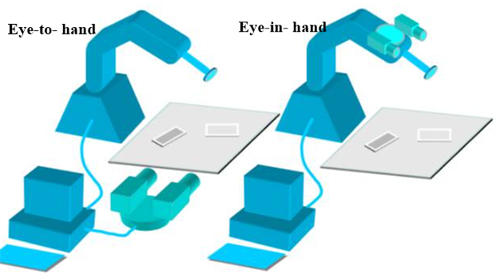
#### 3.1 Eye-to-hand intallment
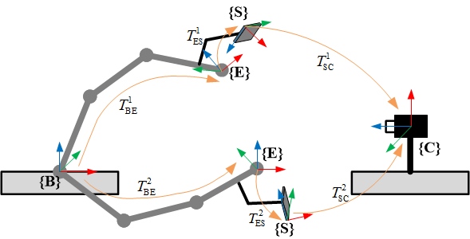
As shown in above figure, this is the eye-to-hand type installment, that is, the camera is installed in the fixed position from which the base of robotic arm has a constant relative position.

> {$\\textbf B$} -- The base coordinate system of robotic arm \
> {$\\textbf E$} -- The end-effector coordinate system \
> {$\\textbf S$} -- The checkerboarder coordinate system \
> {$\\textbf C$} -- The camera coordinate system (generally the RGB sensor coordinate system)

From  base coordinate $\{\text B \}$ to  camera coordinate $\{\text C \}$, the homogeneous tranformation matrix can be derived as follows:
$${{T}\_{\text{BC}}}=T_{\text{BE}}^{1}\cdot T_{\text{ES}}^{1}\cdot T_{\text{SC}}^{1}=T_{\text{BE}}^{2}\cdot T_{\text{ES}}^{2}\cdot T_{\text{SC}}^{2}$$

As coordinate $\{\text E \}$  have a fixed relation to the coordinate $\{\text S\}$,  we can obtian
$$T_{\text{BE}}^{2}{{\left( T_{\text{BE}}^{1} \right)}^{-1}}{{T}\_{\text{BC}}}={{T}\_{\text{BC}}}{{\left( T_{\text{SC}}^{2} \right)}^{-1}}T_{\text{SC}}^{1}$$

We can define $\mathbf{A}=T_{\text{BE}}^{2}{{\left( T_{\text{BE}}^{1} \right)}^{-1}}$,  $\mathbf{B}={{\left( T_{\text{SC}}^{2} \right)}^{-1}}T_{\text{SC}}^{1}$ and $\mathbf{X}={{T}_{\text{BC}}}$, so the probelm becomes:
$$\mathbf{AX}=\mathbf{XB}$$

#### 3.2 Eye-in-hand intallment
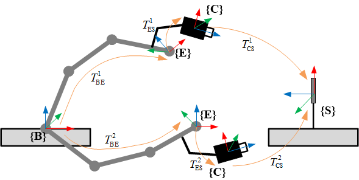
As shown in above figure, this is the eye-in-hand type installment, that is, the camera is installed in the fixed position from which the tool of robotic arm has a constant relative position.
$${{T}\_{\text{BS}}}=T_{\text{BE}}^{1}\cdot T_{\text{EC}}^{1}\cdot T_{\text{CS}}^{1}=T_{\text{BE}}^{2}\cdot T_{\text{EC}}^{2}\cdot T_{\text{CS}}^{2}$$
As  the tranformation matrix $T_{\text{BS}}$ is constant, the following equation can be derived:
$${{\left( T_{\text{BE}}^{2} \right)}^{-1}}T_{\text{BE}}^{1}{{T}\_{\text{ES}}}={{T}\_{\text{ES}}}T_{\text{CS}}^{2}{{\left( T_{\text{CS}}^{1} \right)}^{-1}}$$
where, we can define $\mathbf{A}={{\left( T_{\text{BE}}^{2} \right)}^{-1}}T_{\text{BE}}^{1}$, $\mathbf{B}=T_{\text{CS}}^{2}{{\left( T_{\text{CS}}^{1} \right)}^{-1}}$ and $\mathbf{X}={{T}_{\text{ES}}}$, so the problem become the same type:
$$\mathbf{AX}=\mathbf{XB}$$
So the problem becomes how to solve the above equation, many previous works has been presented. Here, we give four pupolar approaches to addressing the equation like this.
> - [ ]  1. [A new technique for fully autonomous and efficient 3D robotics hand/eye calibration](https://ieeexplore.ieee.org/document/34770) (**IEEE Transactions on robotics and automation**)
> - [ ]  2. [Hand-Eye Calibration](https://journals.sagepub.com/doi/10.1177/027836499501400301) (**he international journal of robotics research**)
> - [ ] 3. [Robot sensor calibration: solving AX= XB on the Euclidean group](http://robotics.snu.ac.kr/fcp/files/_pdf_files_publications/7_c/robot_sensor_calibration.pdf)(**IEEE Transactions on Robotics and Automation**)
> - [x] 4. [Hand-eye calibration using dual quaternions.](https://journals.sagepub.com/doi/abs/10.1177/02783649922066213)(**The International Journal of Robotics Research**)

### 4. Alighnment
In the robotic field, often find objects from the color image, and then calculate the corresponding 3D coordinate value by combining the related depth value. Before the above procedure, need to align the depth image to color image (depth registration).
<!-- 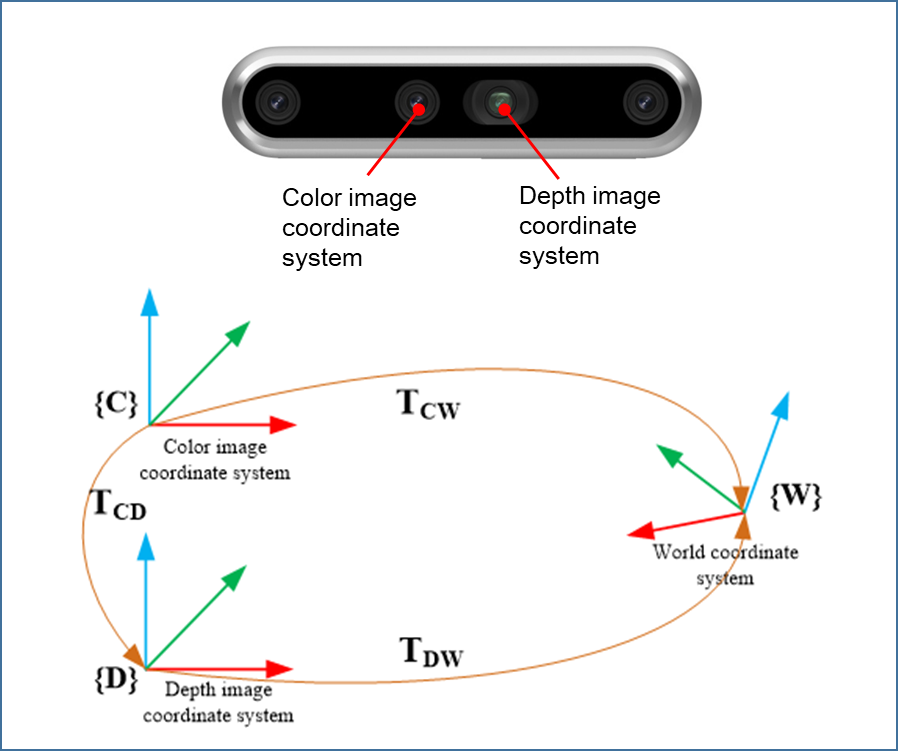 -->
<p align="center">
  
</p>
Homogeneous transformation matrix $T_{CW}$ and $T_{DW}$ can be obtained through the above calibration method, so the matrix $T_{CD}$ is
$${{\text{T}}_{\text{CD}}}={{\text{T}}_{\text{CW}}}\text{T}_{\text{DW}}^{-1}$$

The alignned result is shown as follows.
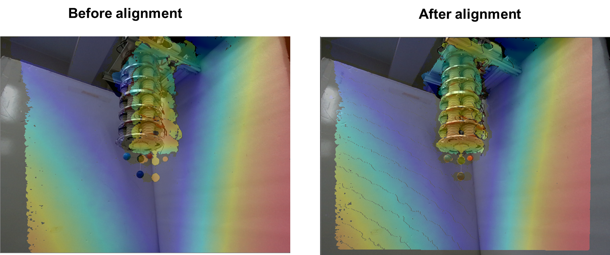


### 5. Mapping depth image to point cloud
In the section, we will discuss on how to reconstruct the 3 dimensional point in the real-world space from the pixel images and the corresponding depth image (alighn the depth images  to the color images). Namely, after we already have the pixel point $u, v$ and depth value $\lambda$,  how we can obtain the related point cloud in thei real-world space, which is of importance in vision servoing of robotics.  In the section, we know that
$$\left[ \begin{matrix}
   u  \\\\
   v  \\\\
   1  \\\\
\end{matrix} \right]=\left[ \begin{matrix}
   {{f}\_{x}} & 0 & {{o}\_{x}}  \\\\
   0 & {{f}\_{y}} & {{o}\_{y}}  \\\\
   0 & 0 & 1  \\\\
\end{matrix} \right]\left[ \begin{matrix}
   x  \\\\
   y  \\\\
   1  \\\\
\end{matrix} \right]$$

where,
$$\begin{align}
  & x=X/Z \nonumber\\\\
 & y=Y/Z \nonumber\\\\
\end{align}$$

As $\lambda = Z$, so
$$ \left[ \begin{matrix}
  Zu  \\\\
  Zv  \\\\
   Z  \\\\
\end{matrix} \right]=\left[ \begin{matrix}
   {{f}\_{x}} & 0 & {{o}\_{x}}  \\\\
   0 & {{f}\_{y}} & {{o}\_{y}}  \\\\
   0 & 0 & 1  \\\\
\end{matrix} \right]\left[ \begin{matrix}
   X  \\\\
   Y  \\\\
   Z \\\\
\end{matrix} \right]$$

For the points in camera space and real-world space:
$$\left[ \begin{matrix}
   X  \\\\
   Y  \\\\
   Z  \\\\
\end{matrix} \right]=\left[ \mathbf{r},\mathbf{t} \right]\left[ \begin{matrix}
   U  \\\\
   V  \\\\
   W  \\\\
   1  \\\\
\end{matrix} \right]$$

and we can make the real-world coordinate system stay the same with the camera coordinated system, so the homogeneous transformation matrix $\left[ \mathbf{r},\mathbf{t} \right]$ become unit matrix. Put all above equation together, the 3D coordinate value from the $u, v$ and $\lambda$
$$\begin{align}
  & U={\lambda \left( u-{{o}\_{x}} \right)}/{{{f}\_{y}}}\; \nonumber\\\\
 & V={\lambda \left( v-{{o}\_{y}} \right)}/{{{f}\_{y}}}\; \nonumber\\\\
 & W=\lambda  \nonumber\\\\
\end{align}$$
### References
1. [Comparing Three Prevalent 3D Imaging Technologies—ToF, Structured Light and Binocular Stereo Vision](https://www.revopoint3d.com/comparing-three-prevalent-3d-imaging-technologies-tof-structured-light-and-binocular-stereo-vision/)
2. [A Brief Introduction to 3D Cameras](https://tech.preferred.jp/en/blog/a-brief-introduction-to-3d-cameras/)
3. [A Flexible New Technique for Camera by Zhang. ](https://www.microsoft.com/en-us/research/wp-content/uploads/2016/02/tr98-71.pdf)
4. [Introduction to Computer Vision CSE Department, Penn State University Instructor: Robert Collins](http://www.cse.psu.edu/~rtc12/CSE486/)
5. [ Camera calibration: explanning camera distortions](https://ori.codes/artificial-intelligence/camera-calibration/camera-distortions/#fn:1)
6. [Automatic Radial Distortion Estimation from a Single Image](http://www.cs.ait.ac.th/~mdailey/papers/Bukhari-RadialDistortion.pdf)
7. [Calibration checkerboard collection](https://markhedleyjones.com/projects/calibration-checkerboard-collection)
8. [Camera calibration in Matlab](https://www.mathworks.com/help/vision/ug/camera-calibration.html#:~:text=The%20calibration%20algorithm%20calculates%20the,focal%20length%20of%20the%20camera.)
9. [A Four-step Camera Calibration Procedure with Implicit Image Correction](http://www.vision.caltech.edu/bouguetj/calib_doc/papers/heikkila97.pdf)
10. [Methods for Simultaneous Robot-World-Hand–EyeCalibration: A Comparative Study](https://www.mdpi.com/1424-8220/19/12/2837/pdf-vor)
