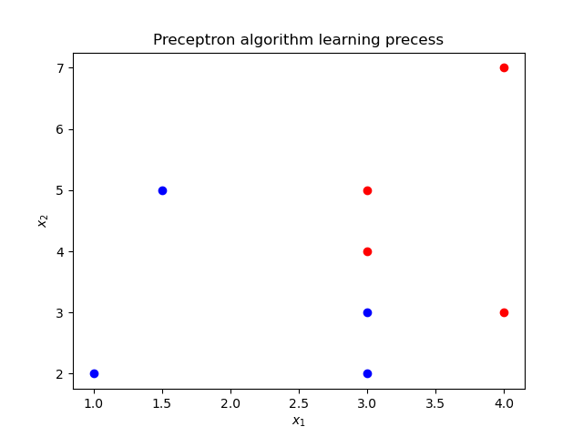

In machine learning, the **perceptron** is an algorithm for supervised learning of binary classfiers. The [perceptron algorithm](https://en.wikipedia.org/wiki/Perceptron) was invented 1958 at the Cornell Aeronautical lab by Frank Rosenblatt.


### Perceptron model
For input space (featured space) $\mathcal{X} = {{\mathbf{R}}^{n}}$ and  output space $\mathcal{Y} =\\{-1,  +1\\}$, the perceptron model can be built by:
$$f(x) = sign(\omega \centerdot x+b)$$
$$sign(x) =
\begin{cases}
+1 & \text{if } x \ge 0,\\\\
-1 & \text{if } x < 0.
\end{cases}$$
where $\omega$ and $b$ are the weight and bias for the above function respectively. Through being trained by the give training data $T = \\{ (x_0, y_0), (x_1, y_1), (x_2, y_2), \cdots, (x_N, y_N)\\}$, where $x_i \in \mathcal{X} =  {{\mathbf{R}}^{n}}$ and $y_i \in \mathcal{Y}=\\{-1, +1\\}$, $i = 1, 2, \cdots, N$. The parameters $\omega$ and $b$ can be leanned through the mentioned data set.  The learned linear hyperplane can divide the training data into two parts labelling +1 and -1.  The schematic diagram is shown as follows.



### Perceptron strategy

In perceptron algorithm, the total distance to the hyperplane is defined to depict its cost function:
$$L\left( \omega ,b \right)=-\sum\limits_{{{x}_{i}}\in M}{{{y}_{i}}\left( \omega \cdot {{x}_{i}}+b \right)}$$
where $M$ is misclassfication data set.
### Perceptron learning algorithm
For the given training data set, the parameters $\omega$ and $b$ can be optimized by minimizing the cost function:
$$\underset{\omega ,b}{\mathop{\min }}\,L\left( \omega ,b \right)=-\sum\limits_{{{x}_{i}}\in M}{{{y}_{i}}\left( \omega \cdot {{x}_{i}}+b \right)}$$
We can use stochastic gradient descent method to solve the above optimized problem. Take partial derivative with respect to $\omega$ and $b$, the iteration strategy can be obtained:
$$\begin{align}
  & \omega \leftarrow \omega +\eta {{y}_{i}}{{x}_{i}} \\
 & b\leftarrow b+\eta {{y}_{i}} \\
\end{align}$$
where $\eta$ is a learning rate hyperparameter set by user.

Based on the aforementioned discussion, the perceptron algorithm can be derived:
$\omega$, $b$
> - **Preceptron algorithm**
> 1. **Input:** training data set: $T = \{ (x_0, y_0), (x_1, y_1), (x_2, y_2), \cdots, (x_N, y_N)\}$, $i = 1, 2, 3, \cdots, N$; learning rate $\eta (0 < \eta \le 1)$;
> 2. **Output:** $\omega$, $b$ and preceptron model: $f(x) = sign(\omega \centerdot x+b)$
> 3. Initialize $\omega_0, b_0$;
> 4. **while**: Choosing the single instance $(x_i, y_i)$ from $T$ until no misclassfication data contained in the set;
> 5. &emsp; **if**  $y_i \left( \omega \cdot x_i +b\right) \le 0$
> 6. &emsp;&emsp; $\omega \leftarrow \omega +\eta {y_i}{x_i}$ and $b\leftarrow b+\eta {{y}_{i}}$
> 7. &emsp; **endif**
> 8. **end while**

### Implementing the algorithm in python3
``` python
from matplotlib import pyplot as plt
import numpy as np
from matplotlib.animation import FuncAnimation

# define a function to realize preceptron algorithm.
def PrecessingPreceptron(point, learning_rate):
    w_set = []
    b_set = []
    w = np.array([0,0])
    b = 0
    flag = 1
    while flag:
        flag = 0
        i = 0
        for i in range(len(point)):
            if point[i,2]*(np.matmul(w, point[i,0:2]) + b) <= 0:
                w = w + learning_rate * point[i,0:2] * point[i,2]
                b = b + learning_rate * point[i,2]
                w_set.append(w)
                b_set.append(b)
                flag = 1
                break
        if flag == 0:
            break
    return w_set, b_set

# DrawFigure is used to draw the process
def DrawFigure(count, w_set, b_set, gap):
    point_x_1 = 0
    point_x_2 = 5
    if count == 0:
        line.set_data([], [])
        return line,
    if gap*count < len(w_set):
        w = w_set[count*gap]
        b = b_set[count*gap]
    else:
        w = w_set[-1]
        b = b_set[-1]
    if w[1] != 0:
        point_y_1 = -(w[0] * point_x_1 + b) / w[1]
        point_y_2 = -(w[0] * point_x_2 + b) / w[1]
        thisx = np.array([point_x_1, point_x_2])
        thisy = np.array([point_y_1, point_y_2])
        line.set_data(thisx, thisy)
        return line,

if __name__ == "__main__":
    # define input data set
    traning_data = np.array([[3, 4, 1],[4, 3, 1], [3,3,-1],[1,2,-1],[3,5,1],[4,7,1],[3,2,-1],[1.5,5,-1]])
    learning_rate = 0.7
    fig, ax = plt.subplots()
    line, = ax.plot([], [], 'k-')
    for index in range(len(traning_data)):
        if traning_data[index,2] == 1:
            ax.plot(traning_data[index, 0], traning_data[index, 1], 'ro')
        else:
            ax.plot(traning_data[index,0], traning_data[index,1],'bo')
    plt.xlabel('$x_1$')
    plt.ylabel('$x_2$')
    plt.title('Preceptron algorithm learning precess')
    w_set, b_set = PrecessingPreceptron(traning_data, learning_rate)
    anim = FuncAnimation(fig, DrawFigure,frames=np.arange(0, 15), fargs=(w_set, b_set, 50), interval=300, blit=True)
    anim.save('preceptron.gif', writer='imagemagick')
    plt.show()
```
**Results:**


### Notes
> - It can be testified that the perceptron algorithm could converge at last within the limited steps of iterations.
> - The original algorithm have multiple solutions coming from: 1. The initial parameters $\omega_0, b_0$; 2. the selection order of misclassficated point in the learning process.
